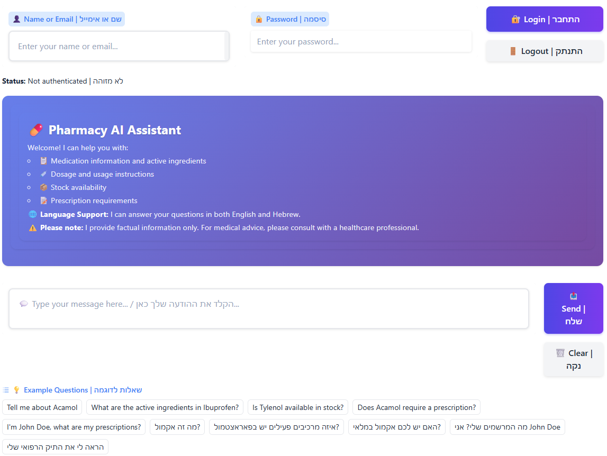
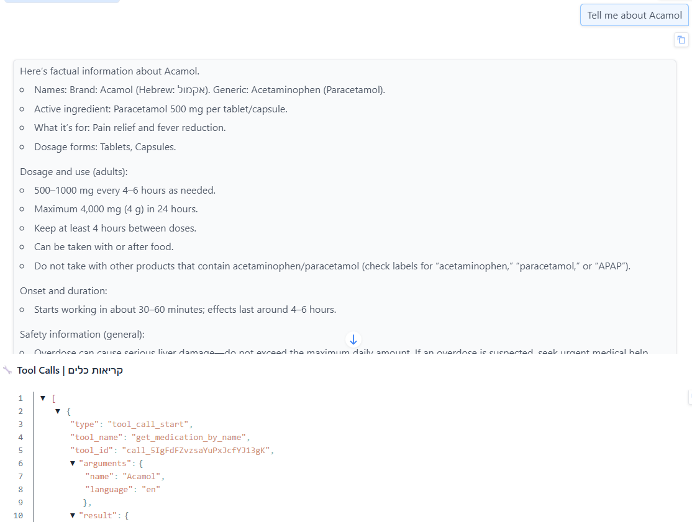
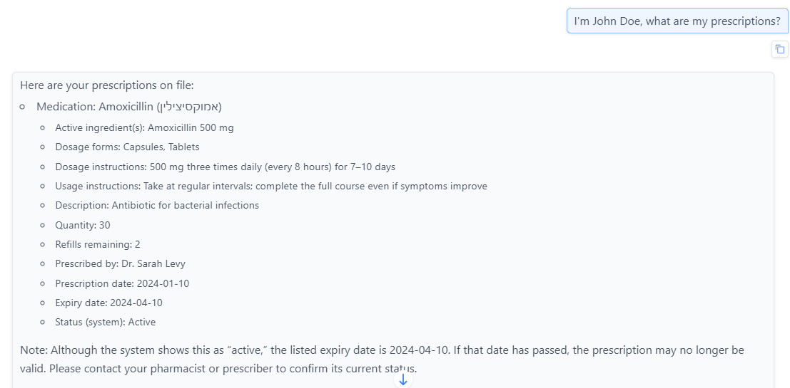

# Pharmacy AI Assistant

An AI-powered pharmacy assistant built with GPT-5, providing real-time text streaming and natural language interaction for medication searches, stock availability checks, and prescription requirement verification. The system supports both Hebrew and English languages.

## Features

- **AI-Powered Assistant**: Real-time text streaming using GPT-5
- **Bilingual Support**: Hebrew and English language support
- **Medication Search**: Fuzzy matching search for medications by name
- **Stock Availability**: Check medication stock and quantity
- **Prescription Verification**: Verify prescription requirements for medications
- **User Management**: Search users and manage prescriptions
- **Multi-Step Flows**: Complex interactions with multiple tool calls
- **Web Interface**: Modern Gradio-based user interface
- **Docker Support**: Containerized deployment ready

## Prerequisites

- **Python 3.11+**: Required Python version
- **pip**: Python package manager
- **OpenAI API Key**: Required for AI agent functionality
- **Docker** (optional): For containerized deployment

## Quick Start

### Local Installation

1. **Clone or navigate to the project:**
   ```bash
   cd Wond
   ```

2. **Create virtual environment:**
   ```bash
   # Windows
   python -m venv venv
   venv\Scripts\activate
   
   # Linux/Mac
   python -m venv venv
   source venv/bin/activate
   ```

3. **Install dependencies:**
   ```bash
   pip install -r requirements.txt
   ```

4. **Configure environment variables:**
   
   Create a `.env` file in the project root:
   ```bash
   OPENAI_API_KEY=your_api_key_here
   RATE_LIMIT_PER_MINUTE=60
   RATE_LIMIT_PER_DAY=1000
   RATE_LIMIT_CONSECUTIVE=10
   ```

5. **Run the application:**
   ```bash
   python main.py
   ```

6. **Access the application:**
   
   Open your browser at `http://localhost:7860`

### Docker Deployment

1. **Build Docker image:**
   ```bash
   docker build -t pharmacy-agent .
   ```

2. **Run container:**
   ```bash
   docker run -p 7860:7860 -e OPENAI_API_KEY=your_api_key_here pharmacy-agent
   ```
   
   Or using `.env` file:
   ```bash
   docker run -p 7860:7860 --env-file .env pharmacy-agent
   ```

3. **Run container in detached mode (background):**
   ```bash
   docker run -d -p 7860:7860 --env-file .env --name pharmacy-agent pharmacy-agent
   ```

4. **View running containers:**
   ```bash
   docker ps
   ```

5. **View container logs:**
   ```bash
   docker logs pharmacy-agent
   ```

6. **Stop container:**
   ```bash
   docker stop pharmacy-agent
   ```

7. **Remove container:**
   ```bash
   docker rm pharmacy-agent
   ```

8. **Access the application:**
   
   Open your browser at `http://localhost:7860`

For detailed Docker instructions, see [docs/setup_and_usage.md](docs/setup_and_usage.md#docker-deployment).

## Screenshots

#### Main Interface


#### Medication Search


#### Stock Check


#### Prescription Check


#### User Prescriptions


## Usage Examples

### Medication Search

- "Tell me about Acetaminophen"
- "What is Paracetamol?"
- "I'm looking for a headache medication"
- "Search for medication by name Aspirin"

### Stock Availability

- "Do you have Acetaminophen in stock?"
- "How many units of Paracetamol do you have?"
- "Check stock availability for Ibuprofen"
- "Is Aspirin available?"

### Prescription Requirements

- "Does Acetaminophen require a prescription?"
- "I need antibiotics, do I need a prescription?"
- "Check if Amoxicillin requires a prescription"
- "Is Metformin prescription-only?"

### User Management

- "What are my prescriptions?"
- "Do I have an active prescription for Amoxicillin?"
- "Search for user John Doe"
- "Find user by email john.doe@example.com"

**Example - Existing User:**
- Name: `John Doe`
- Email: `john.doe@example.com`
- User ID: `user_001`
- Password: `admin123` (for testing authentication)

You can search for this user by name or email:
- "Search for user John Doe"
- "Find user john.doe@example.com"
- "What are the prescriptions for John Doe?"

**Note:** To test authenticated features, use the login form in the application with:
- Username/Email: `John Doe` or `john.doe@example.com`
- Password: `admin123`

## Architecture

The system follows a layered architecture:

```
┌─────────────────┐
│   Gradio UI     │  User Interface Layer
└────────┬────────┘
         │
┌────────▼────────┐
│  Agent Layer    │  OpenAI API Integration
│  (streaming.py) │  Function Calling & Streaming
└────────┬────────┘
         │
┌────────▼────────┐
│  Tools Layer    │  Business Logic
│  (tools/)       │  Tool Functions
└────────┬────────┘
         │
┌────────▼────────┐
│ Database Layer │  Data Access
│  (db.py)        │  JSON Storage
└────────┬────────┘
         │
┌────────▼────────┐
│  Models Layer   │  Data Validation
│  (models/)      │  Pydantic Models
└─────────────────┘
```

For detailed architecture documentation, see [docs/architecture.md](docs/architecture.md).

## Multi-Step Flows

The system supports complex multi-step interactions:

### Flow 1: Stock Availability Check
1. User asks about medication availability
2. Agent searches for medication by name
3. Agent checks stock availability
4. Agent provides complete information

**Example:**
```
User: "Do you have Acetaminophen in stock?"
Agent: [Searches for "Acetaminophen"] → [Checks stock] → 
       "Acetaminophen is available in stock. We have 150 units."
```

### Flow 2: Prescription + Stock Check
1. User asks about prescription requirement
2. Agent searches for medication
3. Agent checks prescription requirement
4. Agent checks stock availability
5. Agent provides complete information

**Example:**
```
User: "I need antibiotics, do I need a prescription?"
Agent: [Searches] → [Checks prescription] → [Checks stock] → 
       "Amoxicillin requires a doctor's prescription. The medication is available in stock."
```

### Flow 3: Complete Medication Information
1. User asks for medication information
2. Agent searches for medication
3. Agent retrieves all details
4. Agent checks prescription requirement
5. Agent provides comprehensive information

For detailed flow documentation, see:
- [Flow 1: Stock Availability](docs/flow1_availability.md)
- [Flow 2: Prescription Check](docs/flow2_prescription.md)
- [Flow 3: Information Query](docs/flow3_information.md)
- [Flow 5: User Prescriptions](docs/flow5_user_prescriptions.md)

## Tools

The system includes the following tools:

1. **get_medication_by_name**: Search medications by name with fuzzy matching
2. **check_stock_availability**: Check medication stock and quantity
3. **check_prescription_requirement**: Verify prescription requirements
4. **get_user_by_name_or_email**: Search users by name or email
5. **get_user_prescriptions**: Get all prescriptions for a user
6. **check_user_prescription_for_medication**: Check active prescription for specific medication

For detailed API documentation, see [docs/api_documentation.md](docs/api_documentation.md).

## Database

The system uses a JSON-based database containing:
- **10 users**: Synthetic user data
- **5 medications**: Medication information with Hebrew and English names
- **Prescriptions**: Links between users and medications

For database structure and documentation, see [docs/database_documentation.md](docs/database_documentation.md).

## Testing

Run the test suite:

```bash
# Run all tests
pytest

# Run specific test file
pytest tests/test_medication_tools.py

# Run with verbose output
pytest -v

# Run with coverage
pytest --cov=app tests/
```

## Evaluation

The system includes comprehensive evaluation test cases for policy adherence:
- No medical advice
- No purchase encouragement
- No diagnosis
- Referral to healthcare professionals

For evaluation test cases and results, see:
- [Evaluation Test Cases](docs/evaluation_test_cases.md)
- [Evaluation Results](docs/evaluation_results.md)

## Documentation

Comprehensive documentation is available in the `docs/` directory:

- [Architecture](docs/architecture.md) - System architecture and components
- [Setup and Usage](docs/setup_and_usage.md) - Installation and usage guide
- [API Documentation](docs/api_documentation.md) - Complete API reference
- [API Documentation](docs/api_documentation.md) - Complete API reference and tool implementation details
- [Database Documentation](docs/database_documentation.md) - Database structure and operations
- [Models Documentation](docs/models_documentation.md) - Data models and schemas
- [Flow Documentation](docs/flow1_availability.md) - Multi-step flow documentation

## Project Structure

```
Wond/
├── app/                      # Application code
│   ├── agent/                # AI agent implementation
│   ├── tools/                 # Tool functions
│   ├── database/             # Database management
│   ├── models/                # Data models
│   ├── prompts/              # System prompts
│   └── main.py               # Main entry point
├── data/                      # Data files
│   └── database.json         # JSON database
├── docs/                      # Documentation
│   ├── architecture.md
│   ├── setup_and_usage.md
│   ├── api_documentation.md
│   └── ...
├── tests/                     # Test suite
├── Dockerfile                 # Docker configuration
├── requirements.txt          # Python dependencies
└── README.md                  # This file
```

## Security Considerations

1. **API Keys**: Stored in environment variables, never in code
2. **Input Validation**: All inputs validated before processing
3. **Safe Defaults**: Prescription requirements default to "required" on errors
4. **No Medical Advice**: Agent explicitly prohibited from giving medical advice
5. **User Data Protection**: Authenticated users can only access their own data

## Policy Adherence

The agent strictly adheres to the following policies:

- ❌ **No Medical Advice**: The agent does not provide medical advice or recommendations
- ❌ **No Purchase Encouragement**: The agent does not encourage medication purchases
- ❌ **No Diagnosis**: The agent does not diagnose medical conditions
- ✅ **Healthcare Professional Referral**: The agent refers users to healthcare professionals when appropriate

## Performance

- **Streaming**: Real-time text streaming for responsive user experience
- **Parallel Tool Execution**: Independent tools execute in parallel for improved performance
- **Database Caching**: Module-level caching reduces file I/O operations
- **Optimized Queries**: Efficient database queries with fuzzy matching

## Contributing

1. Review the documentation in `docs/`
2. Follow the code structure and patterns
3. Write tests for new features
4. Update documentation as needed


## Support

For issues or questions:
1. Check the documentation in `docs/`
2. Review error logs
3. Check GitHub issues (if applicable)
4. Contact project maintainers

---

**Note**: This project uses GPT-5 for AI capabilities. Ensure you have a valid OpenAI API key configured in your `.env` file.

